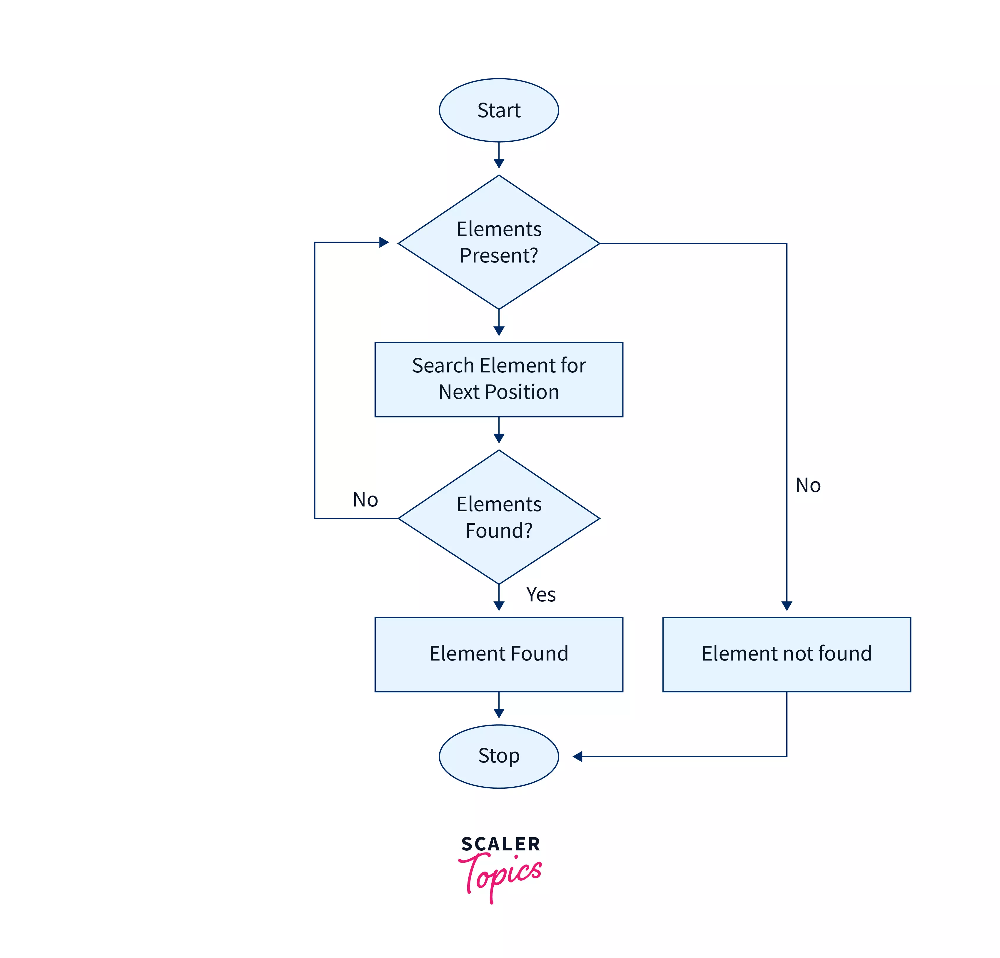

# 🔹 Linear Search
---
## 1️⃣ Theory (Concept Explanation)
1. Linear Search is also called **Sequential Search**.
2. It searches an element by comparing one by one with each element of the list.
3. Searching starts from the first element of the array.
4. Each element is compared with the search key.
5. If a match is found, the search is successful.
6. If the end of the list is reached, the search is unsuccessful.
7. It works on sorted as well as unsorted data.
8. No preprocessing of data is required.
9. It is the simplest searching technique.
10. Suitable for small data sets.
11. Performance decreases as input size increases.
12. Best case occurs when the element is at the first position.
13. Worst case occurs when the element is last or absent.
14. It is easy to implement and understand.
15. Used when data is not frequently searched.

⸻
# 🔹 BINARY SEARCH

## Theory (Concept Explanation)
1.	Binary Search is an efficient searching technique.
2.	It works only on sorted data.
3.	It follows the divide and conquer approach.
4.	The search space is divided into two halves.
5.	Comparison is done with the middle element.
6.	If key equals middle element, search is successful.
7.	If key is smaller, search continues in left half.
8.	If key is larger, search continues in right half.
9.	The process is repeated until element is found.
10.	Search ends when low index exceeds high index.
11.	Number of comparisons is reduced.
12.	Best case occurs when key is middle element.
13.	Worst case occurs when element is absent.
14.	It is faster than linear search.
15.	Suitable for large data sets.

